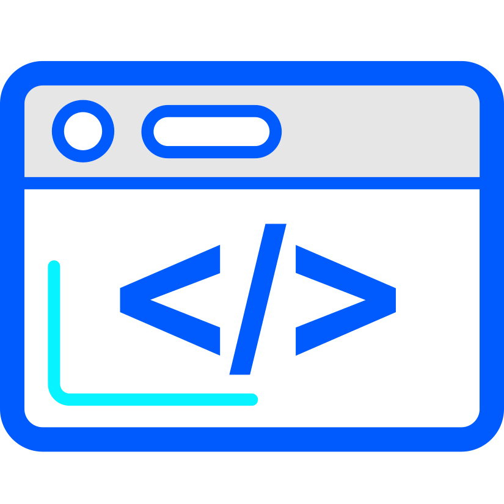

<!--
**Borghese-Gladiator/Borghese-Gladiator** is a ✨ _special_ ✨ repository because its `README.md` (this file) appears on your GitHub profile.

Here are some ideas to get you started:

- 🔭 I’m currently working on ...
- 🌱 I’m currently learning ...
- 👯 I’m looking to collaborate on ...
- 🤔 I’m looking for help with ...
- 💬 Ask me about ...
- 📫 How to reach me: ...
- 😄 Pronouns: ...
- ⚡ Fun fact: ...
-->

  
   
 &nbsp;
 &nbsp;

- 💻 Developer (4+ years) – Python & JS/TS | Backend Developer at [Klaviyo](https://www.klaviyo.com/) working on marketing reporting metrics
- 🚀 Side Project – Building a Scraping-as-a-Service (SaaS) tool with Kubernetes ephemeral pods + LLM parsing (DeepSeek)  
- 🥅 2025 Goals – Eat healthier, exercise, and build something cool  
- 🏸 Fun Fact – I love badminton and once made the Junior US National Team!

  
## 💻 Tech Stack

## 🏆 My Stats:

    &nbsp;&nbsp;
    &nbsp;&nbsp;

